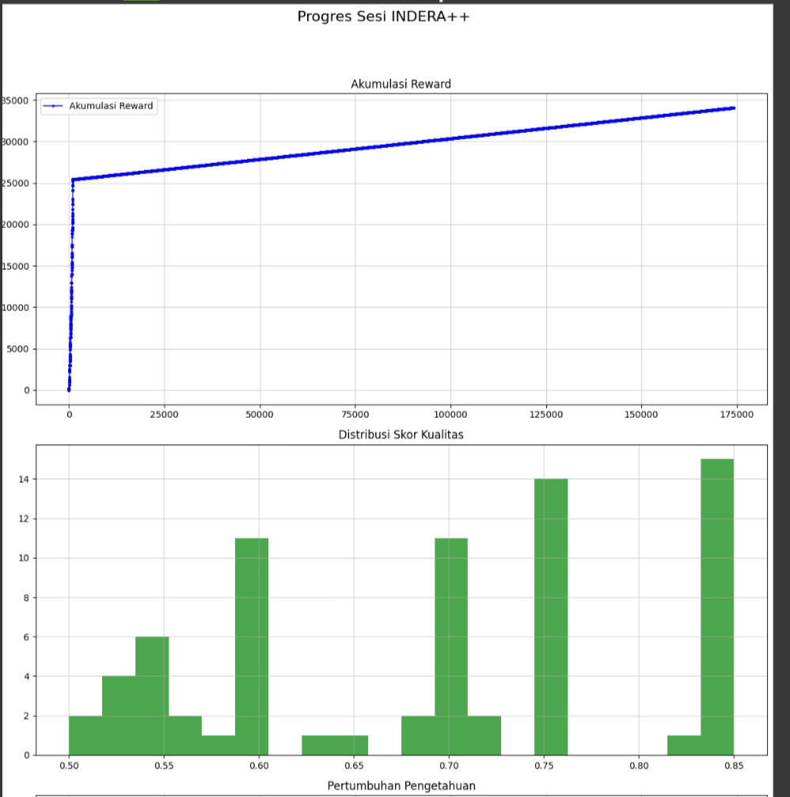

1. Core Philosophy: Human Idea, AI Execution

INDERA++ stands as a testament to a modern development paradigm. This project is a product of a unique synergy:

🧠 The Human Visionary (The Author): The core concept, the overarching strategy, the 'why' and 'what' of the project—the vision of an autonomous learning agent—is the original intellectual contribution of the author.

🤖 The AI Code-smith (LLM Partner): The Python code itself was generated in collaboration with a Large Language model. The AI acted as a tireless programming partner, translating complex logical requirements into functional, robust code.

This project showcases how human creativity can direct AI tools to build complex systems far more rapidly than traditional methods would allow.

2. ⚠️ Mandatory Environment: Google Colab + T4 GPU

This is the most critical point. This project is not merely "recommended" for Google Colab; it is architecturally bound to it. It will not run in other environments without a complete rewrite.
Requirement
Reason
Google Colab
The entire file system logic (/content/drive/My Drive/) and session management is hardcoded for the Colab environment.
T4 GPU
All NLP and Machine Learning tasks are optimized for CUDA via PyTorch, specifically targeting the T4 GPU provided in Colab's free tier. CPU performance is impractically slow (hours vs. minutes).
Google Drive
State persistence is non-negotiable. The knowledge base (.db), the trained brain (.joblib), and progress logs are designed to be saved to Google Drive, allowing INDERA++ to learn across multiple sessions.
Warning: Attempting to run this on a local machine, a different cloud provider, or even Colab with a CPU runtime is not a supported use-case and will result in errors.

3. System Workflow Visualization

This diagram illustrates the core operational loop of INDERA++.
graph TD     A[Start Session] --> B{Queue Empty?};     B -- Yes --> C[🧠 Reflection Mode];     C --> D[Generate New Keywords from Knowledge];     D --> E{Add to Keyword Queue};     B -- No --> F{Task Available?};     F -- URL Task --> G[Crawl & Process URL];     F -- Keyword Task --> H[Search Keyword on Web];     H --> E;     G --> I{Evaluate Content Quality};     I --> J[Extract New Keywords & Links];     J --> K{Update 'Brain' Training Data};     J --> E;     E --> F;      subgraph "Learning & Graduation"         L[Train 'Brain' Periodically]         M{Graduation Criteria Met?}         M -- Yes --> N[Unlock Full Web Exploration]         M -- No --> O[Continue in Wikipedia Mode]     end      K --> L;     F --> M;

4. In-Depth Features

🧠 The Adaptive Brain (KeywordQualityModel)

What it is: A machine learning model (SGDRegressor) that learns to predict the potential quality of a research keyword.

How it works: When INDERA++ processes a webpage, it links the quality score of that page back to the source keyword that led to it. Over time, the model learns to associate certain types of keywords with high-quality, information-rich content. This guides its curiosity towards more promising paths.

🎓 Graduated Learning Protocol

Phase 1: Wikipedia Sandbox. INDERA++ begins its life by only exploring Wikipedia. This builds a robust, clean, and highly-interlinked foundational knowledge base.

Phase 2: Full Web Exploration. After achieving specific benchmarks for knowledge acquired (GRADUATION_REWARD_THRESHOLD) and average content quality (GRADUATION_QUALITY_THRESHOLD), it "graduates" and begins to use DuckDuckGo to explore the wider web, applying its learned wisdom.

🤔 Reflection Mode (Anti-Stall Mechanism)

Problem: What happens when an AI runs out of tasks? It stops.

Solution: When both the URL and keyword queues are empty, INDERA++ enters a "reflective state." It queries its own database for its highest-quality content, re-analyzes that text, and extracts new, potentially unexplored concepts to bootstrap its curiosity. It essentially creates its own work.

🌐 Ethical & Resilient Crawling

Robots.txt Adherence: Strictly follows the rules defined by website owners.

Domain Blacklisting: If a domain consistently returns errors, it's temporarily blacklisted to avoid wasting resources. Wikipedia is immune to this rule.

Clear User-Agent: Identifies itself as INDERA-AI-Researcher/10.0 so its activity is transparent.

5. Technology Stack

Technology
Role
Python 3
Core programming language.
Google Colab
The mandatory runtime and compute environment.
PyTorch
Backend for running NLP models on the T4 GPU.
SentenceTransformers
State-of-the-art NLP model for understanding text semantics.
Scikit-learn
Powers the KeywordQualityModel for predictive learning.
spaCy
Used for advanced NLP tasks like Named Entity Recognition.
SQLite3
The lightweight, file-based database for storing all acquired knowledge.
Pandas & Matplotlib
Used for data analysis and generating progress visualization plots.
Requests & BeautifulSoup4
The backbone of the web crawler for fetching and parsing HTML.
Google Drive API
Used implicitly via Colab for all state persistence.

6. 🚀 Step-by-Step Execution Guide

7. Prepare Your Environment:

Ensure you are logged into your Google Account.

Download this project from GitHub (Code > Download ZIP) and unzip it.

2. Upload to Google Drive:

Navigate to your Google Drive.

Upload the single file indera.py to the main "My Drive" directory.

3. Open in Google Colab:

Find indera.py in your Drive, right-click it.

Select Open with > Google Colaboratory. A new Colab tab will open.

4. Configure the Runtime:

In the Colab menu, navigate to Runtime -> Change runtime type.

In the dropdown menu, select T4 GPU. This step is crucial.

Click Save.

5. Initiate the Run:

To start the entire process, go to Runtime -> Run all.

The first cell will ask for permission to connect to your Google Drive. Click Connect to Google Drive and follow the pop-up prompts to authorize it.

The script will now run from top to bottom. An INDERA_Project_V10 folder will be created in your Google Drive to store all outputs. You can monitor the progress in the output cells.

7. Future Roadmap & Potential Improvements

Semantic Deduplication: Use vector similarity to identify and discard pages with similar meaning, not just identical text.

Advanced Content Models: Replace the heuristic-based quality score with a trained classifier (e.g., a fine-tuned BERT model) for more nuanced content evaluation.

Knowledge Graph Creation: Instead of just storing text, extract relationships between entities (e.g., "Elon Musk" - founder of - "SpaceX") and store them in a graph database format.

Interactive Dashboard: Create a simple web-based dashboard (using Streamlit or Flask) to query and explore the knowledge base in real-time.

